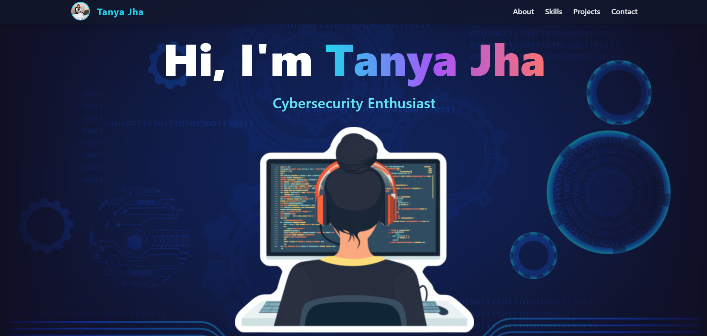
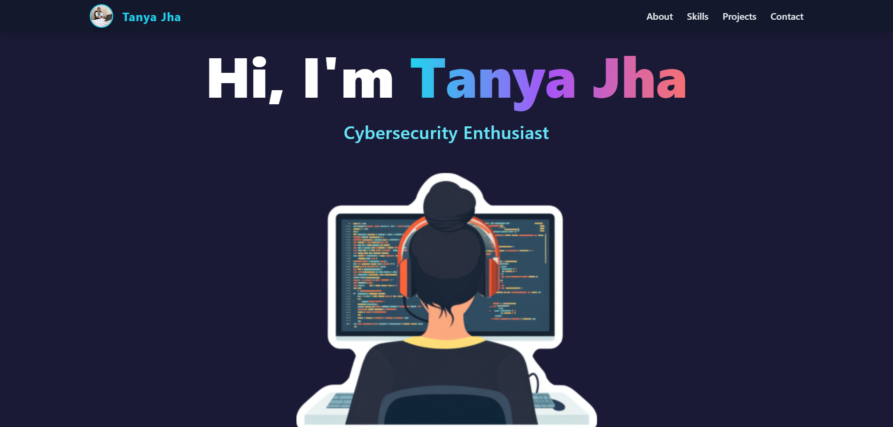
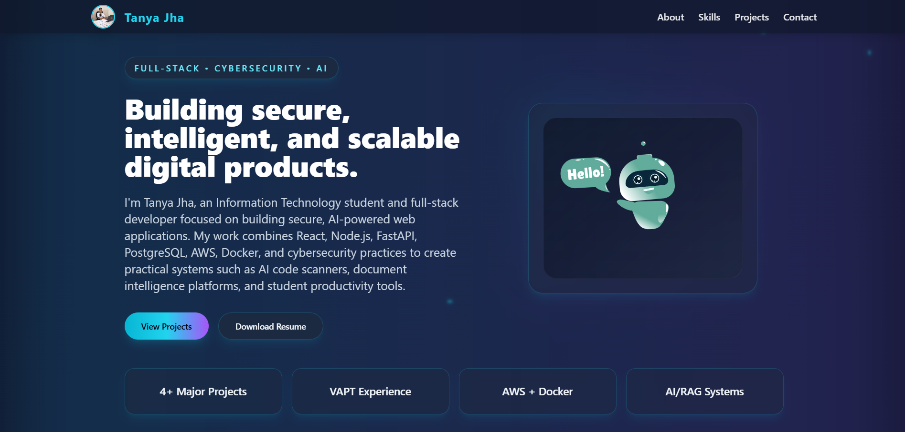
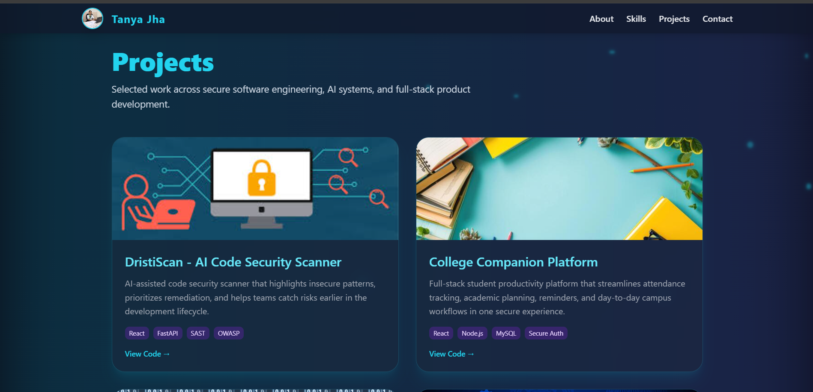

<!-- ====================== HEADER ====================== -->
<h1 align="center">Tanya Jha – Portfolio</h1>

<p align="center">
Full-Stack Developer • Cybersecurity Enthusiast • AI + DevSecOps Builder
</p>

<p align="center">
  <a href="https://tanyajha-web.vercel.app">
    
  </a>
  <a href="https://github.com/tanyajha29">
    
  </a>
  <a href="https://www.linkedin.com/in/tanya-jha-b2b72a2a0/">
    
  </a>
</p>

<p align="center">
  
</p>

---

## About

I’m Tanya Jha, an Information Technology student and full-stack developer focused on building secure, AI-powered web applications.

My work combines modern frontend development, scalable backend systems, cybersecurity practices, and AI integrations to build practical, real-world solutions such as security scanners, document intelligence platforms, and productivity tools.

---

## Features

- Project-focused portfolio showcasing real-world systems  
- Security-aware development approach  
- AI + DevSecOps oriented architecture  
- Live demos and GitHub integration  
- Smooth animations using Framer Motion and Lottie  
- Fully responsive across devices  

---

## Tech Stack

### Frontend


### Backend


### Databases


### Cloud & DevOps


### Cybersecurity
- VAPT (Web & API Testing)  
- OWASP Top 10  
- Burp Suite  
- SQLMap  
- Secure Authentication (MFA, JWT)  

### AI / ML
- RAG (Retrieval-Augmented Generation)  
- OCR (Document Processing)  
- OpenAI / Ollama  
- Data Processing Pipelines  

---

## Portfolio Sections

- About  
- Projects  
- Skills  
- Certifications  
- Contact  

---

## Highlight Projects

### DristiScan – AI Code Security Scanner
- Automated vulnerability detection using static analysis and AI  
- Generates structured reports with severity scoring  
- Integrates OWASP, CWE, and NVD using RAG  

---

### FormOS – Intelligent Document Processing Platform
- OCR + AI-based document intelligence system  
- RAG-powered assistant for querying extracted data  
- Chrome extension for automated form filling  

---

### College Companion Platform
- Full-stack student productivity system  
- Attendance tracking and document management  
- AWS integration with MFA authentication  

---

### Global Conflict Impact Intelligence Platform
- AI-driven geopolitical risk analysis system  
- ML-based forecasting for impact prediction  
- Interactive dashboards and visualization  

---

## Screenshots

> Add screenshots in /screenshots folder

| Section | Preview |
|--------|--------|
| Hero |  |
| About |  |
| Projects |  |

---

## Run Locally

```bash
git clone https://github.com/tanyajha29/your-portfolio-repo
cd your-portfolio-repo
npm install
npm run dev
